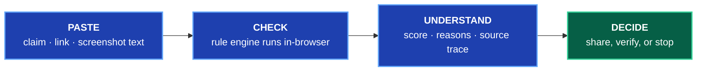
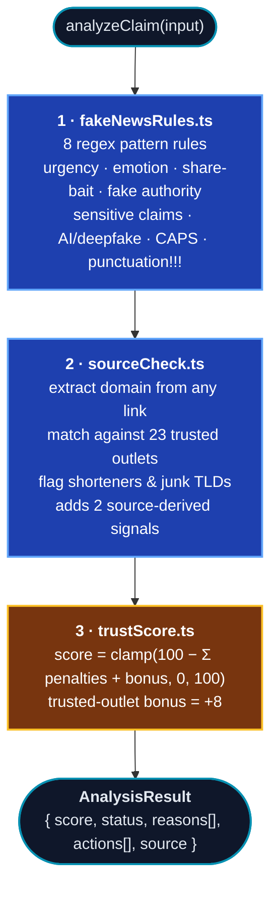
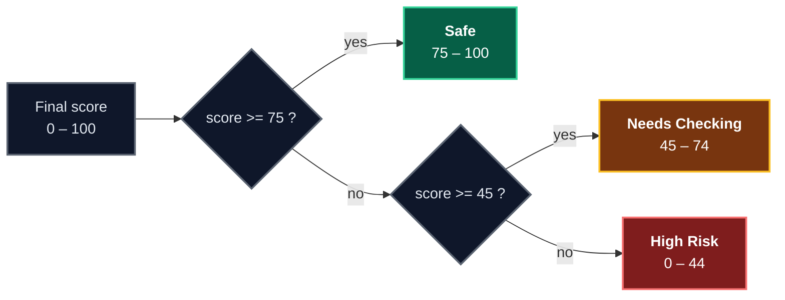
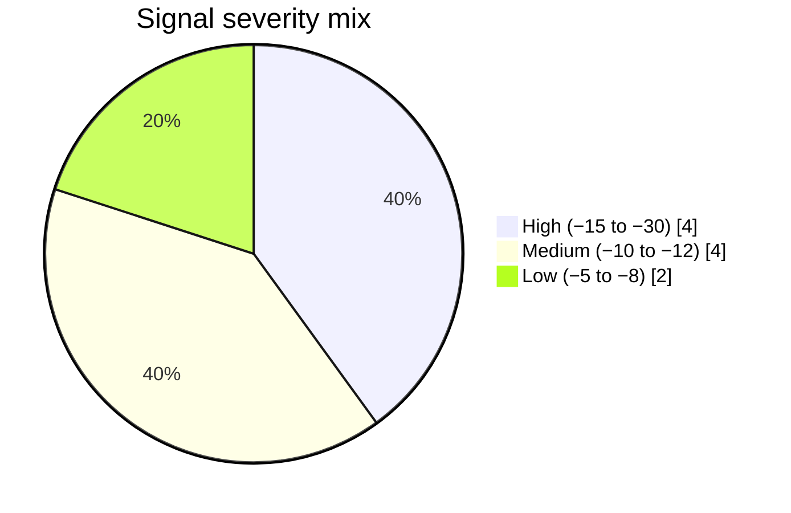

<!-- ══════════════════════════ HEADER ══════════════════════════ -->
<div align="center">


<a href="https://truthtap-ai.netlify.app/">
  
</a>

<br/>

<a href="https://truthtap-ai.netlify.app/">
  
</a>


<br/>


</div>

---

## `$` whoami

```
 ████████╗██████╗ ██╗   ██╗████████╗██╗  ██╗
    ██║   ██╔══██╗██║   ██║   ██║   ██║  ██║
    ██║   ██████╔╝██║   ██║   ██║   ███████║
    ██║   ██╔══██╗██║   ██║   ██║   ██╔══██║
    ██║   ██║  ██║╚██████╔╝   ██║   ██║  ██║
    ╚═╝   ╚═╝  ╚═╝ ╚═════╝    ╚═╝   ╚═╝  ╚═╝
         ████████╗ █████╗ ██████╗
            ██║   ██╔══██╗██╔══██╗
            ██║   ███████║██████╔╝
            ██║   ██╔══██║██╔═══╝
            ██║   ██║  ██║██║
            ╚═╝   ╚═╝  ╚═╝╚═╝
```

```bash
truthtap@web:~$ cat about.txt

  WHAT ......... A youth-friendly verification tool for online claims
  BUILT FOR .... UNESCO Global Youth Hackathon 2026  ·  #YouthHackathon2026
  THEME ........ Play Your Part — Youth Designing the Future of MIL
  DOES ......... Trust Score (0-100) · risk reasons · source trace · MIL quiz
  RUNS ......... entirely in your browser — nothing you paste ever leaves it
  COSTS ........ nothing. no API keys, no server, no per-request billing

truthtap@web:~$ ./truthtap --explain

  The gap isn't information. It's the PAUSE before sharing.
  So the pause has to be fast, non-judgemental, and explainable —
  or nobody takes it.
```

<div align="center">

**[▶ Try it live](https://truthtap-ai.netlify.app/)** · [Check a claim](https://truthtap-ai.netlify.app/check) · [MIL Quiz](https://truthtap-ai.netlify.app/quiz) · [About MIL](https://truthtap-ai.netlify.app/about)

</div>

---

## `$` cat highlights.md

| | |
|---|---|
| 🔒 **Zero paid APIs** | The whole analysis engine is deterministic rules running in the browser. No keys, no backend, no per-request cost, no server to fall over. |
| 🔍 **Explainable by design** | Every point deducted maps to a named, human-readable reason. No black box, no hallucinations, same input → same output, always. |
| 🧠 **Media literacy built in** | A 10-question quiz across three modes, drawn from documented viral misinformation cases. |
| 🕶️ **Privacy-respecting** | Because analysis is local, pasted content is never transmitted anywhere. There is nothing to intercept. |
| 📱 **Mobile-first** | Blue/cyan identity, rounded cards, green/amber/red status colours — designed for a phone in the three seconds before sharing. |
| ♿ **Accessible** | Semantic HTML, keyboard-navigable controls, visible focus rings, `prefers-reduced-motion` support. |

---

## `$` cat flow.md

Four taps between seeing something online and deciding what to do about it.



---

## `$` cat engine.md

Everything below is deterministic and runs client-side. No network calls, no model inference.



### Score → verdict



<details>
<summary><b>🔬 The full signal library — click to expand</b></summary>

<br/>

**8 regex pattern rules** (`FAKE_NEWS_RULES` in `src/lib/fakeNewsRules.ts`):

| Rule id | Severity | Penalty | Catches |
|---|---|---|---|
| `share-bait` | 🔴 high | **−15** | "Share now or you'll lose it" style pressure |
| `sensitive-claim` | 🔴 high | **−15** | health / money / political claims that need real sourcing |
| `urgent-language` | 🟠 medium | **−12** | manufactured urgency, "before it's deleted" |
| `fake-authority` | 🟠 medium | **−12** | "doctors say", "experts warn" with nobody named |
| `emotional-language` | 🟠 medium | **−10** | outrage and shock framing |
| `ai-deepfake` | 🟠 medium | **−10** | "100% real video" and other deepfake tells |
| `excessive-caps` | 🟢 low | **−8** | SHOUTING AS AN ARGUMENT |
| `excessive-punctuation` | 🟢 low | **−5** | `!!!` / `???` |

**2 source-derived signals** (applied after `sourceCheck.ts` runs):

| Reason id | Severity | Penalty | When |
|---|---|---|---|
| `suspicious-link` | 🔴 high | **−30** | link shortener, low-trust domain, or junk TLD |
| `no-source` | 🔴 high | **−18** | no link, outlet or author to check at all |

**Bonus:** `TRUSTED_SOURCE_BONUS = +8` when the content links to one of 23 trusted outlets (Reuters, AP, BBC, AFP, Al Jazeera, DW, The Guardian, NYT, UNESCO, UN, WHO, NASA…).



</details>

---

## `$` tree ./truthtap-ai

```
truthtap-ai/
├── README.md
├── next.config.js               # output: 'export'  ← the whole deploy story
├── tailwind.config.ts
├── tsconfig.json
├── .env.example                 # no keys needed — future upgrades only
│
├── public/
│   ├── logo.svg
│   └── screenshots/             # drop UI screenshots here for submission
│
├── src/
│   ├── app/
│   │   ├── layout.tsx           # navbar + footer shell, SEO metadata
│   │   ├── page.tsx             # Home — hero, CTAs, features, how-it-works
│   │   ├── globals.css
│   │   ├── check/
│   │   │   ├── page.tsx         # metadata (server component)
│   │   │   └── CheckClient.tsx  # input ⇄ result controller
│   │   ├── quiz/
│   │   │   ├── page.tsx
│   │   │   └── QuizClient.tsx   # quiz state machine
│   │   └── about/page.tsx       # what is MIL + disclaimer
│   │
│   ├── components/
│   │   ├── ui/                  # Button, Card, Badge, Icons — zero deps
│   │   ├── layout/              # Navbar, Footer
│   │   ├── home/                # FeatureCard, HowItWorksSection
│   │   ├── checker/             # ClaimInput, TrustScoreCard, RiskReasonList,
│   │   │                        # ActionGuide, SourceTraceCard, ResultPanel
│   │   └── quiz/                # QuizCard, QuizResult
│   │
│   ├── lib/                     # ←── THE BRAINS ──→
│   │   ├── analyzeClaim.ts      # orchestrator
│   │   ├── fakeNewsRules.ts     # 8 pattern rules + 2 source reasons + bonus
│   │   ├── sourceCheck.ts       # offline source tracing, 23 trusted outlets
│   │   └── trustScore.ts        # scoring + verdict thresholds
│   │
│   ├── data/                    # ←── THE "DATABASE" ──→
│   │   ├── quizQuestions.ts     # 10 MIL questions, 3 modes
│   │   └── sampleClaims.ts      # 6 demo chips for the Check page
│   │
│   └── types/index.ts           # shared TypeScript contracts
│
└── docs/
    ├── proposal.md              # UNESCO submission proposal
    ├── pitch-script.md          # 3-minute pitch video script
    ├── problem-statement.md     # the problem, in depth
    └── demo-flow.md             # exactly what to click on stage
```

**Why this shape:** rules, source-checking, scoring and orchestration each own one file. Adding a new misinformation pattern means adding **one object** to `fakeNewsRules.ts` — the score, the reasons list and the result UI all pick it up automatically. The engine is pure functions with no side effects, so it's trivial to test and reason about.

---

## `$` cat stack.md

| Layer | Choice | Why |
|---|---|---|
| Framework | **Next.js 16** (App Router, static export) | Current and supported; zero server runtime in production |
| Language | **TypeScript** | Type-safe contracts shared between the engine and the UI |
| Styling | **Tailwind CSS** | Fast, consistent, matches the design tokens |
| Icons | Custom inline SVG | No UI library → tiny bundle |
| "Database" | **`src/data/*.ts`** | Claims + quiz bank as typed data files. Nothing to provision. |
| Backend | **None, by design** | 100% client-side engine; no server is ever required |
| Hosting | **Netlify** (any static host) | `output: 'export'` → plain HTML/CSS/JS, deployable anywhere |

> **Note on the upgrade:** this project moved off Next.js 14 — end-of-life since Oct 2025, with a critical React Server Components vulnerability cluster disclosed *after* its final patch that will never be fixed on the 14.x line — to **Next.js 16 + React 19**, and switched to `output: 'export'`. Since the app was always 100% client-side with zero Server Actions, API routes or middleware, static export costs nothing functionally. It just makes that architecture explicit at build time and removes the server runtime — and its entire attack surface — from production.

---

## `$` npm run dev

**Prerequisites:** Node.js **20.9+** and npm.

```bash
# 1 · install
npm install

# 2 · run the dev server
npm run dev
#    → http://localhost:3000

# 3 · build the real static output and preview exactly what deploys
npm run build          # → out/  (plain HTML/CSS/JS, no server)
npx serve -s out       # preview the actual static export locally
```

> ℹ️ **No environment variables required.** `.env.example` lists optional future upgrades only. The MVP is fully functional with zero keys and has no backend or database of any kind.

---

## `$` ./truthtap --demo

Tap a sample chip on the **[Check page](https://truthtap-ai.netlify.app/check)**:

| Sample chip | Verdict | Score |
|---|---|---|
| "School exam cancelled tomorrow" | 🔴 **High Risk** | `0–44` |
| "Doctors warn about this fruit" | 🔴 **High Risk** | `0–44` |
| "Share now or you'll lose it" | 🔴 **High Risk** | `0–44` |
| "Miracle tea trend" | 🟠 **Needs Checking** | `45–74` |
| "100% real leader video" | 🟠 **Needs Checking** | `45–74` |
| Verified news with a trusted source link | 🟢 **Safe** | `75–100` |

Then open **Source Trace** to see the origin analysis, and play the **[MIL Quiz](https://truthtap-ai.netlify.app/quiz)** — 10 questions across *Real or Fake?* (4), *Safe to Share?* (4) and *AI or Human?* (2), each with a full explanation.

---

## `$` npm run build && deploy

`next.config.js` sets `output: 'export'`, so the build produces a plain `out/` folder with **no Next.js server involved in production at all**.

<details open>
<summary><b>Netlify</b> — currently deployed here</summary>

<br/>

```bash
Build command:      npm run build
Publish directory:  out
Environment vars:   (none)
```

</details>

<details>
<summary><b>Vercel</b> — zero config</summary>

<br/>

1. Push to a GitHub repository
2. [vercel.com/new](https://vercel.com/new) → **Import** the repo
3. Vercel auto-detects Next.js and the static export — leave env vars **empty**
4. **Deploy** → live in ~1 minute

</details>

<details>
<summary><b>GitHub Pages · Cloudflare Pages · S3 · any static host</b></summary>

<br/>

```bash
npm run build
# then upload the contents of out/ — that is the entire deployment.
# There is no server process to configure anywhere.
```

</details>

---

## `$` vim src/lib/fakeNewsRules.ts

Add a new misinformation pattern — that's the whole change:

```ts
{
  id: "clickbait-numbers",
  label: "Clickbait number hook",
  description: "\u201cYou won't believe #7\u201d style hooks are engagement bait.",
  penalty: 8,
  severity: "low",
  patterns: [/\byou won'?t believe number \d+/i, /\btop \d+ secrets\b/i],
}
```

The score, the reasons list and the result UI all pick it up automatically — no other file changes.

---

## `$` cat DISCLAIMER

> [!WARNING]
> **TruthTap AI is a learning and verification-support tool — not a replacement for human judgment or professional fact-checkers.**
>
> A high Trust Score is **not proof that something is true**. A low score is an invitation to investigate, not a conviction. Always confirm important claims with trusted outlets, and when in doubt, ask a teacher, guardian or expert.

---

## `$` cat LICENSE

Created for the **UNESCO Global Youth Hackathon 2026**. Free to use, learn from and build upon for educational and non-commercial purposes.

---

<div align="center">

```
┌────────────────────────────────────────────────────────────┐
│   Think First.  ·  Verify Always.  ·  Share Responsibly.   │
└────────────────────────────────────────────────────────────┘
```

<a href="https://truthtap-ai.netlify.app/">
  
</a>


</div>
